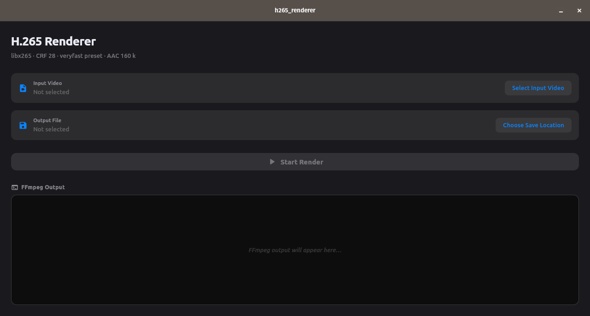

# H.265 Renderer 🎬

A premium Flutter desktop application designed to transcode video files into the modern, highly efficient H.265 (HEVC) codec using FFmpeg. 

Features a sleek dark-themed interface, path picker utilities, live terminal encoding log preview, and automated cross-compilation pipeline configurations.

---

## Screenshots 📸



---

## Features ✨

- 🗂️ **Dynamic Path Selection**: Easily specify input files and choose destination directories using native OS file pickers.
- ⚙️ **Optimized Transcoding Defaults**: Configured for high-efficiency encoding:
  - **Video Codec**: `libx265`
  - **Preset**: `veryfast` (excellent speed-to-efficiency balance)
  - **Constant Rate Factor (CRF)**: `28` (optimal file size with excellent visual quality)
  - **Audio Codec**: `AAC` (160k, stereo)
- 🖥️ **Live Logging Console**: Real-time streaming of FFmpeg's encoding statistics (FPS, bitrate, speed, ETA) directly inside the app.
- 🧩 **Smart FFmpeg Resolution**: Automatically loads the FFmpeg executable next to the compiled application binary or falls back to the system environment `PATH` in development.
- 📦 **Automated Bundling**: Includes CMake integration to automatically bundle the FFmpeg executable into the final installer/release folder.

---

## 📥 Download the Latest Release

- Download the latest Windows build (with bundled FFmpeg):
  
  👉 [windows-release-with-ffmpeg.zip](https://github.com/kareemwael9898/flutter-h265-renderer/releases/download/release-ffmpeg-3/windows-release-with-ffmpeg.zip)
  
  [See all releases](https://github.com/kareemwael9898/flutter-h265-renderer/releases)

---

## Technical Architecture & Setup 🛠️

### Prerequisites

To build and run the application locally, you will need:
- [Flutter SDK](https://docs.flutter.dev/get-started/install) (3.27+ / 3.41+ recommended)
- [FFmpeg](https://ffmpeg.org/download.html) binary:
  - **Windows**: `ffmpeg.exe`
  - **Linux/macOS**: `ffmpeg`

### Directory Structure

```
.
├── bin/                      # Copy local FFmpeg binaries here for bundling
│   └── ffmpeg.exe (or ffmpeg)
├── lib/
│   └── main.dart             # Core application UI and process logic
├── screenshots/              # Application screenshots and demo media
├── test/
│   └── widget_test.dart      # Smoke tests for the main application UI
├── windows/                  # Windows runner config (includes CMake copy step)
└── linux/                    # Linux runner config (includes CMake copy step)
```

---

## How to Run & Build 🚀

### Running in Development

1. Ensure `ffmpeg` is available on your system's `PATH`.
2. Run standard Flutter execution:
   ```bash
   flutter pub get
   flutter run
   ```

### Building for Production (with FFmpeg Bundling)

To package a standalone executable with FFmpeg included:

1. Create a `bin` directory in the root of the project.
2. Download and place the target platform's `ffmpeg` binary inside `bin/`:
   - On Windows: Place `bin/ffmpeg.exe`
   - On Linux: Place `bin/ffmpeg`
3. Run the platform-specific build command:

#### Windows
```bash
flutter build windows --release
```
*Note: The CMake build configuration in `windows/CMakeLists.txt` will automatically copy `bin/ffmpeg.exe` into the build output folder (`build/windows/x64/runner/Release/`) next to `h265_renderer.exe`.*

#### Linux
```bash
flutter build linux --release
```
*Note: The CMake build configuration in `linux/CMakeLists.txt` will automatically bundle `bin/ffmpeg` under `build/linux/x64/release/bundle/`.*

---

## CI/CD Pipeline 🤖

The project includes GitHub Actions workflows under `.github/workflows/`:

- **`Build Windows Application (with FFmpeg)`** (`build_windows_with_ffmpeg.yml`):
  - Automates downloading the latest official Win64 GPL FFmpeg binary from BtbN.
  - Places it in the local `bin/` workspace.
  - Builds the release version of the Flutter app.
  - Packages and uploads a ZIP artifact containing the application executable and the bundled FFmpeg binary ready for redistribution.
- **`Build Windows Application`** (`build_windows.yml`):
  - Fast compiler test workflow validating release builds without downloading external binaries.
